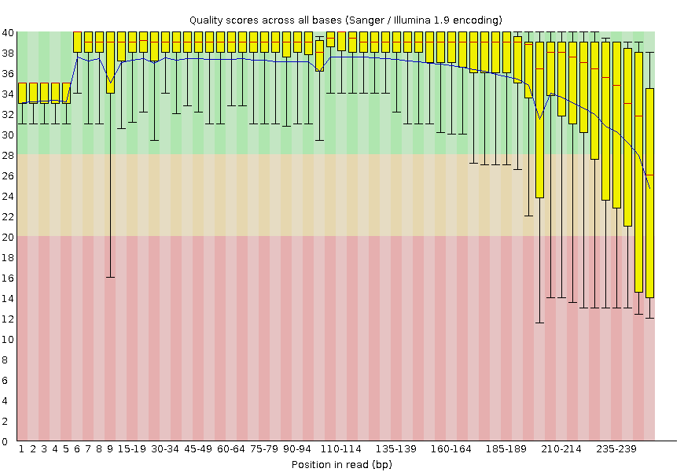

<h1 align="center">
A02
</h1>

<p style="text-align: center;">
    <object hspace="50">
        <strong>Due</strong></a>: Sep 12, 2024 by 11:59 p.m.
    </object>
    <object hspace="50">
        <strong>Points</strong></a>: 60
    </object>
</p>

## Q01

You run FastQC on a set of sequencing reads and observe the following "Per base sequence quality" plot.

-   **a)** Describe what this plot is showing.
-   **b)** What does this pattern typically indicate about the sequencing run?
-   **c)** How might this affect downstream analyses if left uncorrected?

<figure markdown>
{ width=500 }
</figure>

## Q02

In a FastQC report, you notice a high percentage of overrepresented sequences that match known Illumina adapters.

-   **a)** What step in data preprocessing should you perform to address this issue?
-   **b)** How might the presence of adapter sequences affect genome assembly if not removed?

## Q03

You observe in your "Per sequence GC content" plot in your FastQC report a bimodal distribution.

-   **a)** What does a bimodal distribution in this plot typically suggest?
-   **b)** List a possible reason for this observation.
-   **c)** How would you further investigate the cause of this pattern?

## Q04

Explain the concept of $k$-mers in the context of genome assembly.
How does the choice of $k$-mer size affect the assembly process?
Provide examples of potential issues with very small and very large k-mer sizes.

## Q05

Describe the greedy algorithm approach to genome assembly:

-   **a)** Outline the basic steps of the algorithm.
-   **b)** What are the advantages and disadvantages of this approach?
-   **c)** Give an example scenario where the greedy algorithm might fail to produce the correct assembly.

## Q06

You are given the following set of reads from a DNA sequencing experiment:
{`ATGGCTA`, `GGCTAAC`, `CTAACGT`, `AACGTAG`, `CGTAGCT`, `TAGCTAA`, `GCTAACG`, `TAACGTA`, `ACGTAGT`}.

-   **a)** Using the greedy algorithm, show the steps to assemble these reads.
    Assume a minimum overlap of 3 bases.
    For each step, clearly state which reads you are merging and the resulting sequence.
    If there are multiple possibilities with the same overlap length, explain your choice.
-   **b)** What is the final assembled sequence?
-   **c)** Is this assembly unique?
    Why or why not?
-   **d)** Identify a potential problem with this assembly that might not reflect the true original sequence.
    Explain your reasoning.

!!! note "Clarification"
    "Unique assembly" in the context of DNA sequence assembly refers to a situation where there is only one possible way to combine the given reads (DNA fragments) to reconstruct the original sequence.
    In other words, if there are multiple valid ways to combine these reads then the assembly is not unique.

## Q07

You are given the following set of reads from a DNA sequencing experiment:

```text
@read1
ATGCGTAC
+
IIIIIIII
@read2
CGTACGTA
+
IIIIIFFF
@read3
CGTACATA
+
FFIIIIFF
@read4
TACGTAGT
+
FFHHIIII

```

-   **a)** Construct a de Bruijn graph for these reads using $k$ = 5, where $k$ is the edge length.
    Draw the graph, clearly labeling nodes and edges.
-   **b)** Identify and explain any features in your graph that might complicate genome assembly, such as bubbles/bulge, tips, or cycles.
-   **c)** Propose a possible original sequence that could have generated these reads.
    If multiple possibilities exist, explain why.
-   **d)** How would increasing the k-mer size to 5 change the structure of the graph?
    Discuss both potential benefits and drawbacks of this change.

!!! note
    In your de Bruijn graph, represent the frequency of each edge by labeling it with a number.

## Q08

You are working on assembling a bacterial genome. After initial quality control and assembly, you notice that your assembly is highly fragmented with a low N50 value.

-   **a)** List three possible reasons for this poor assembly.
-   **b)** For each reason, suggest a strategy to improve the assembly.
-   **c)** How would you validate the quality of your improved assembly?

## Q09

Design a step-by-step workflow for preprocessing raw Illumina sequencing data and performing a de novo genome assembly.
For each step, briefly explain its purpose and mention one commonly used bioinformatics tool that could be used to perform that step.

## Programming+

These problems are not required and will not impact your BIOSC 1540 grade.
The instructor will assess these separately to validate correctness without an assigned grade.
Thus, you may work on these problems individually or in a team-based setting and "due" by the end of the semester.
Happy coding!

**Acceptable languages**: Python v3.10+, Rust v1.80+, Mojo v24.4+

**Files:** [FASTQ](./a02-example.fastq){:a02-example.fastq}

!!! success "Rewards"
    Engaging with these optional programming problems offers several valuable academic and professional growth opportunities.

    -   Consistent engagement with these **Programming+** problems will allow me to write more detailed, compelling recommendation letters highlighting your computational skills.
    These personalized letters can significantly boost your applications for future academic programs, internships, or job opportunities.
    -   If there is enough interest, optional Friday recitations will be provided.
    This will give you individualized attention to accelerate learning and actionable feedback on your code and problem-solving approaches.
    -   Exceptional solutions may be featured on our course website with the students' permission. This is a way for us to recognize and appreciate your hard work and dedication to these problems.

!!! note
    These problems would be similar to ones given in a major-only version of the class.
    Although, there would be more relevant instructions during class and would be given more than a week to complete.

### P1

Write a script that does the following:

-   Reads the FASTQ file.
-   Calculates and saves the mean quality score for each read as a CSV.
    Your score should subtract the 33 from each ASCII encoding.
-   Makes the "Per base sequence quality" as produced by FastQC.

Example output format:

!!! quote "CSV"
    ```csv
    read,length,mean_quality
    310547a8-d2e3-47a6-a9ff-ec4f7eeaf9de,199,9.7
    ```

### P2

Implement a function that takes a DNA sequence and a k-mer size as input, and returns a dictionary of unique k-mer counts.
Then use this function to:

-   Count all 3-mers in the sequences from any FASTQ file.
-   Print the top 5 most frequent 3-mers and their counts.
-   Explain how this information might be useful in genome assembly.

### P3

Implement a simple de Bruijn graph construction algorithm:

-   Write a function that takes a list of reads and a $k$-mer size (for edges) as input.
-   The function should return a dictionary representing the de Bruijn graph, where keys are ($k-1$)-mers and values are lists of possible next bases.
-   Use your function to construct a de Bruijn graph for the reads in a FASTQ file with k=4.
-   Print the node with the highest out-degree (i.e., the ($k-1$)-mer with the most possible next bases).
-   Identify any bubbles in the graph (nodes with multiple outgoing edges that later reconverge).

If you can implement a function to traverse this graph and generate a possible assembly, explain your approach and show the result.
