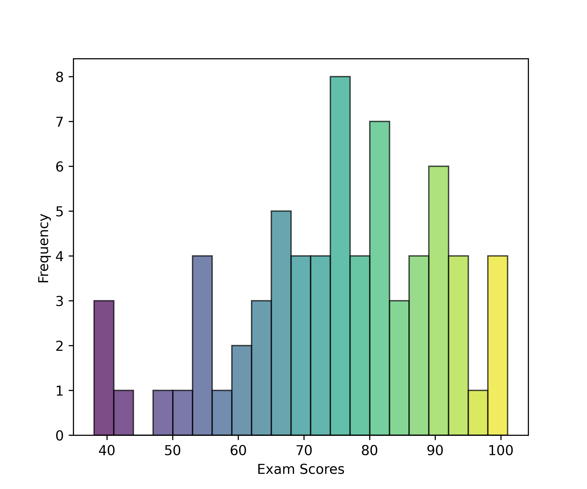
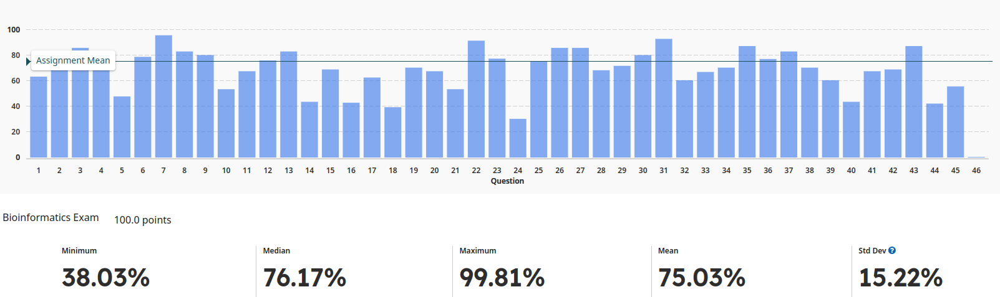

<h1 align="center">
<b>Bioinformatics Exam</b>
</h1>

    <object hspace="50">
        <strong>When</strong></a>: Oct 3, 2024 at 4:00 pm.
    </object>
    <object hspace="50">
        <strong>Points</strong></a>: 100
    </object>

[**2024 Fall Bioinformatics Exam**](./2024f-exam-bioinformatics.pdf) ([Key](./2024f-exam-bioinformatics-key.pdf))

!!! quote "Grade statistics"
    <figure markdown>
    
    </figure>

!!! quote "Question statistics"
    <figure markdown>
    
    </figure>

## Review guide

This guide covers the major themes of the exam, providing a broad framework for your review.
Since the exam is open note, concentrate on developing a deep understanding of the major concepts and approaches, rather than memorizing specific facts.

-   **Different Sequencing Approaches:** Be familiar with the types of sequencing technologies used in bioinformatics.
-   **Read Types:** Understand the differences between sequencing reads (e.g., single-end and paired-end) and how they influence downstream analysis.
-   **General Workflow Components:** Know the steps involved in typical sequencing workflows and common issues that arise.
-   **Basic Terminology:** Ensure you understand key terms related to genome assembly.
-   **General Algorithms:** Be aware of the types of algorithms used for assembling genomes.
-   **Assembly Evaluation:** Know the kinds of metrics used to evaluate genome assemblies and why they are important.
-   **Process Overview:** Understand what gene annotation entails and how computational tools are used to predict gene function.
-   **Gene Features:** Be familiar with the typical elements of a gene that are annotated.
-   **Types of Alignment:** Understand the key differences between global and local alignment methods.
-   **Gap Penalty Models:** Be aware of how gaps are handled during sequence alignment and why different models exist.
-   **Multiple Sequence Alignment (MSA):** Know what MSA is used for and how it helps in comparing sequences.
-   **RNA-seq Overview:** Understand what transcriptomics involves, especially in the context of RNA sequencing.
-   **Single-cell vs. Bulk Data:** Know the differences between these approaches and why you would use one over the other.
-   **Normalization:** Be familiar with the idea of normalization in RNA-seq data analysis and why it’s necessary.
-   **Basic Mapping Concepts:** Know how reads are mapped to reference genomes and the key challenges involved in this process.
-   **Suffix Arrays:** Understand the role of suffix arrays in bioinformatics.
-   **Different Approaches:** Understand the general types of alignment strategies.
-   **Transcript Quantification:** Be aware of the methods used to quantify gene expression levels.
-   **Generative Models in RNA-seq:** Understand the purpose of generative models.
-   **Expectation-Maximization (EM) Algorithm:** Be familiar with the general purpose of the EM algorithm.
-   **Two-Phase Inference Process:** Understand Salmon's distinction between the online and offline phases.
-   **Transcript-Fragment Assignment Matrix**: Know the role of the assignment matrix in RNA-seq data analysis.
-   **Statistical Models:** Know why certain statistical models are used to analyze gene expression data.
-   **Interpreting Results:** Be familiar with general principles for interpreting the significance of changes in gene expression.

## Past exams

These are relevant, past exams.
Note that in the Spring 2024 semester we had two quizzes instead of one exam.

-   [**2024 Spring genomics**](./past/2024s-quiz-genomics.pdf) ([Key](./past/2024s-quiz-genomics-key.pdf))
-   [**2024 Spring transcriptomics**](./past/2024s-quiz-transcriptomics.pdf) ([Key](./past/2024s-quiz-transcriptomics-key.pdf))
