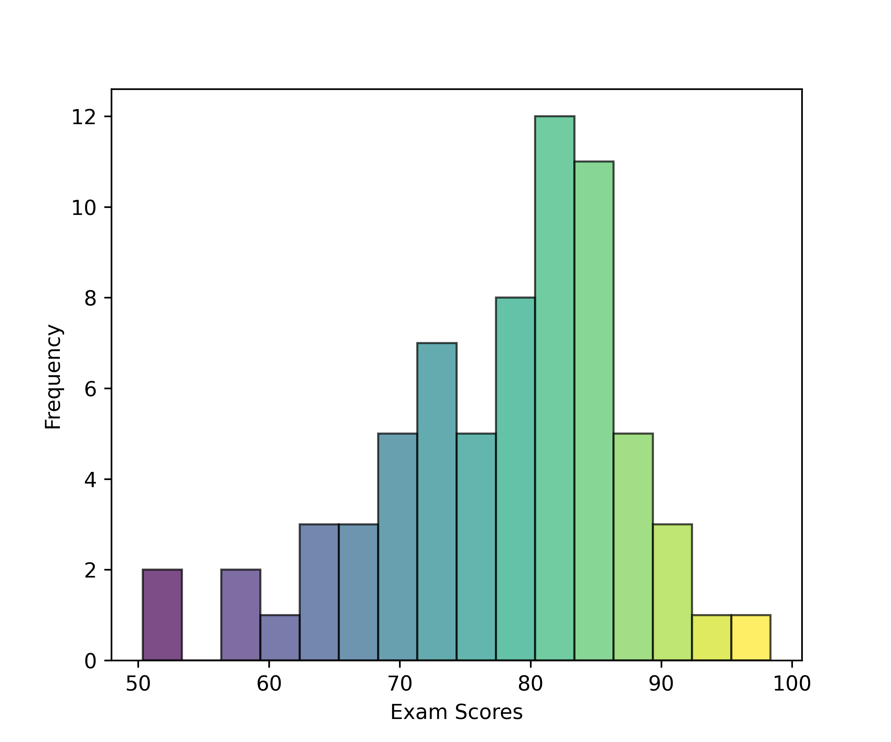

<h1 align="center">
<b>Computational Structural Biology Exam</b>
</h1>

    <object hspace="50">
        <strong>When</strong></a>: Oct 14, 2024 at 4:00 pm.
    </object>
    <object hspace="50">
        <strong>Points</strong></a>: 100
    </object>

[**2024 Fall CSB Exam**](./2024f-exam-csb.pdf) ([Key](./2024f-exam-csb-key.pdf))

!!! quote "Grade statistics"
    <figure markdown>
    
    </figure>

!!! quote "Question statistics"
    <figure markdown>
    
    </figure>

## Review guide

This guide covers the major themes of the exam, providing a broad framework for your review.
Since the exam is open note, concentrate on developing a deep understanding of the major concepts and approaches, rather than memorizing specific facts.

### Lecture 11: Introduction to Structural Biology

-   Explain the roles of covalent bonds, such as peptide bonds, in stabilizing primary protein structures, and how noncovalent forces drive protein folding and dynamic interactions.
-   Describe the hierarchy of protein structure, including primary (sequence of amino acids), secondary (alpha helices, beta sheets), tertiary (3D shape of a polypeptide), and quaternary structures (multi-chain complexes).
-   Understand how electron density maps from techniques like X-ray crystallography are used to determine atomic positions in protein structures.
-   Explain how Cryo-Electron Microscopy (Cryo-EM) allows for protein structure determination without crystallization, and its importance in studying large, dynamic complexes in near-native states, especially for observing macromolecular assemblies.
-   Explain the characteristics of intrinsically disordered proteins (IDPs), including their lack of stable 3D structure under physiological conditions and the challenges they pose for structure prediction compared to well-ordered proteins.

### Lecture 12: Protein Structure Prediction

-   Understand the importance of protein structure prediction in fields such as drug discovery, biotechnology, and the understanding of disease mechanisms.
-   Explain the challenges in protein structure prediction, including Levinthal's paradox and the complexity of efficiently navigating conformational space.
-   Describe the concept of rugged energy landscapes in protein folding and how proteins navigate these landscapes to achieve their functional conformations.
-   Explain the basics of homology modeling, including the sequence similarity thresholds.
-   Explain how coevolutionary analysis identifies pairs of residues that evolve together, indicating proximity in the 3D structure, and how this information informs structural predictions.
-   Describe how AlphaFold uses deep learning, coevolutionary data, and neural network-based pattern recognition to predict protein structures with high accuracy.

### Lecture 13: Molecular Dynamics (MD) Principles

-   Explain the role of molecular dynamics (MD) simulations in studying protein folding, binding, and flexibility over time.
-   Understand why atoms are modeled as classical particles in MD simulations and the implications of ignoring quantum mechanical effects.
-   Apply Newton's laws of motion in the context of atomistic simulations within molecular dynamics.
-   Describe the components of force fields, including bond stretching, angle bending, and torsions, and explain how they contribute to the potential energy in MD simulations.
-   Identify scenarios in which quantum mechanical effects cannot be ignored and discuss the limitations of classical mechanics in these cases.
-   Explain the key noncovalent interactions—hydrogen bonding, electrostatic interactions, van der Waals forces, and hydrophobic effects—and their roles in molecular recognition.

### Lecture 14: Molecular System Representations

-   Identify criteria for selecting high-quality experimental structures for simulations.
-   Explain strategies for adding missing residues or atoms in protein models prior to conducting MD simulations.
-   Describe the steps involved in protein preparation for simulations.
-   Evaluate the suitability of a protein structure for simulations based on factors such as completeness, functional state, and clash scores.
-   Explain the purpose of using periodic boundary conditions (PBC) in molecular simulations.

### Lecture 15: Ensembles and Atomistic Insights

-   Define microstates and macrostates, and explain their significance in statistical mechanics and molecular simulations.
-   Discuss the importance of adequately sampling microstates in MD simulations to compute reliable ensemble averages.
-   Explain how thermostats (like Berendsen and Nosé-Hoover) and barostats are used to control temperature and pressure in MD simulations.
-   Distinguish between the equilibration (relaxation) phase and the production (data collection) phase in MD simulations.
-   Use Root Mean Square Deviation (RMSD) as a metric to assess conformational changes in proteins over time during simulations.
-   Use Root Mean Square Fluctuation (RMSF) to evaluate the flexibility of specific residues or regions in a protein during simulations.
-   Explain the relationship between energy and probability in molecular simulations.

### Lecture 16: Structure-Based Drug Design

-   Describe the stages of the drug discovery pipeline and explain the role of computational methods.
-   Identify key factors in selecting protein targets for drug design.
-   Explain the role of virtual screening in narrowing down potential compounds from large chemical libraries during drug discovery.
-   Describe how Gibbs free energy (ΔG) determines the strength of protein-ligand interactions.
-   Explain the contributions of enthalpy (noncovalent interactions) and entropy (flexibility) to the thermodynamics of protein-ligand binding.
-   Explain the purpose of alchemical free energy simulations in calculating changes in free energy.
-   Describe how alchemical simulations work.
-   Explain the method of thermodynamic integration (TI) used in alchemical simulations.

### Lecture 17: Docking and Virtual Screening

-   Describe the docking process in virtual screening, including how selecting one representative protein conformation simplifies protein-ligand binding prediction.
-   Explain the importance of choosing an appropriate protein conformation to account.
-   Describe methods for detecting binding pockets, such as alpha shape theory and grid-based techniques.
-   Discuss the challenges in detecting cryptic binding sites.
-   Explain the process of pose optimization in docking to optimize ligand positions within the binding site for accurate binding affinity prediction.

### Lecture 18: Ligand-Based Drug Design

-   Explain how molecular descriptors like LogP, molecular weight, and topological polar surface area (TPSA) are used to predict bioactivity in ligand-based drug design.
-   Describe how Extended Connectivity Fingerprints (ECFPs) encode structural information for similarity comparisons in ligand-based drug design.
-   Explain the basics of how molecular fingerprints are generated by hashing atom-specific properties.
-   Discuss the challenges of efficiently exploring chemical space to find active compounds similar to known bioactive molecules.

## Past exams

These are relevant, past exams.

-   [**2024 Spring CADD**](./past/2024s-quiz-cadd.pdf) (No key was made)
