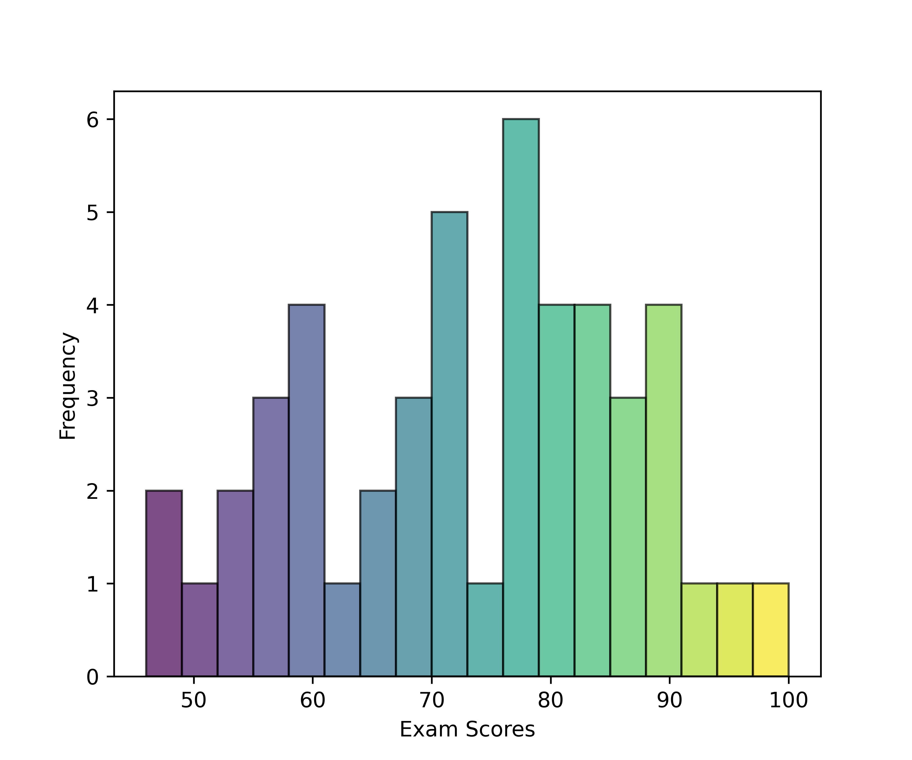
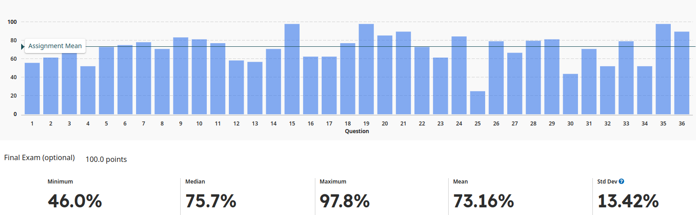

<h1 align="center">
<b>Final Exam</b>
</h1>

    <object hspace="50">
        <strong>When</strong></a>: Dec 16, 2024 at 10:00 am.
    </object>
    <object hspace="50">
        <strong>Points</strong></a>: 100
    </object>

This final exam was optional and allowed students to replace their lowest exam grade.

[**2024 Fall Final Exam**](./2024f-exam-final.pdf)

!!! quote "Grade statistics"
    <figure markdown>
    
    </figure>

!!! quote "Question statistics"
    <figure markdown>
    
    </figure>
