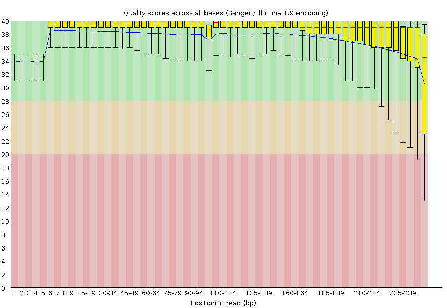
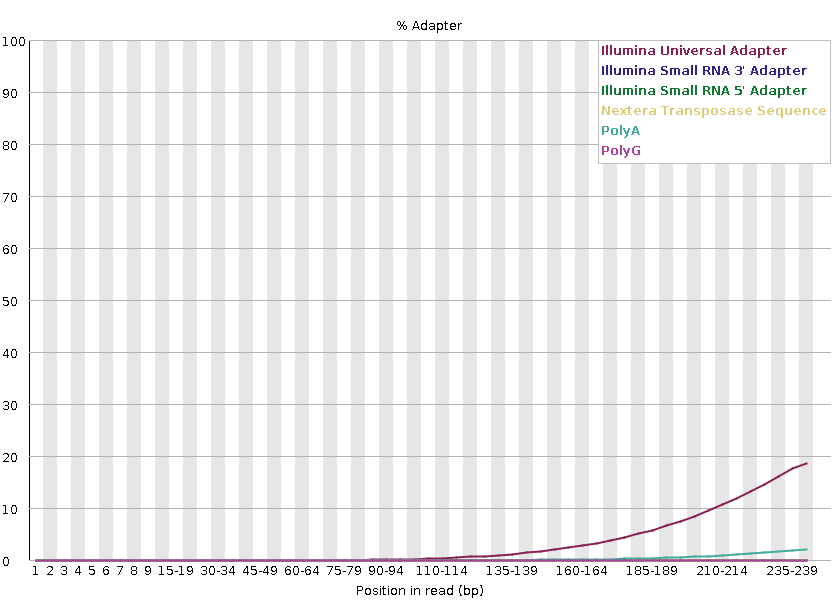
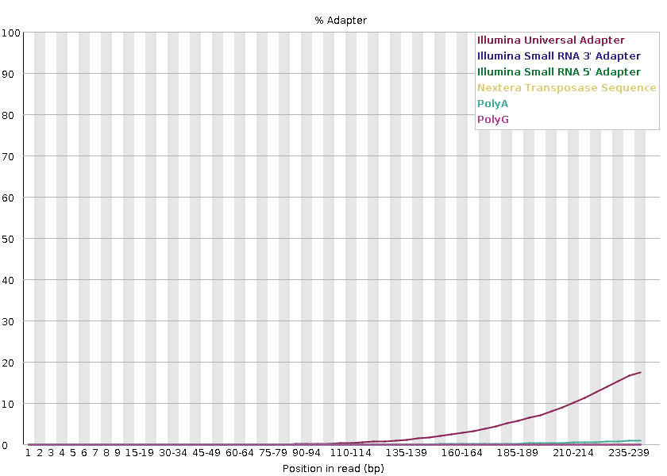
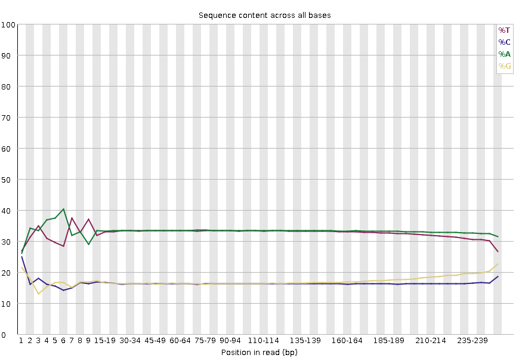
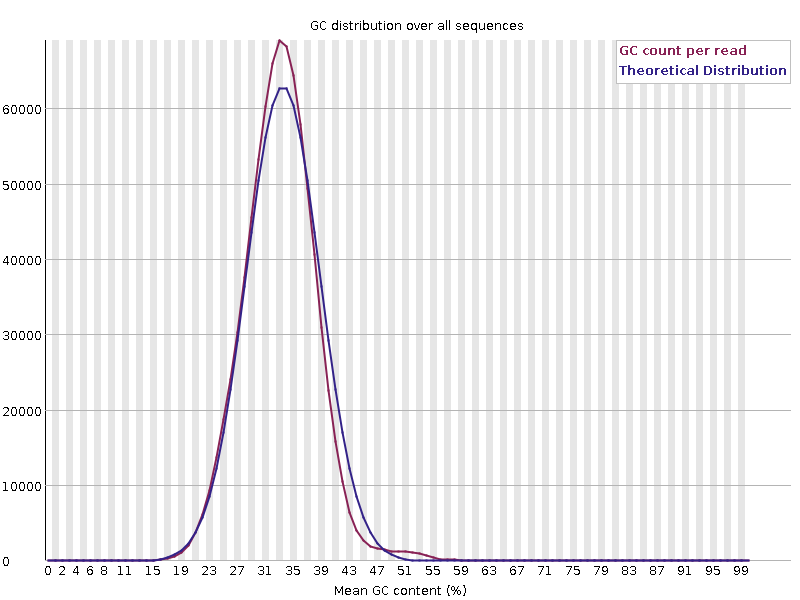
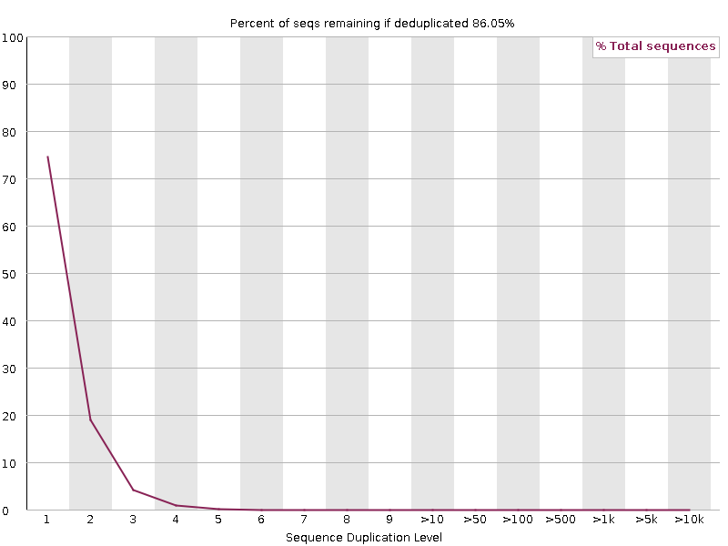
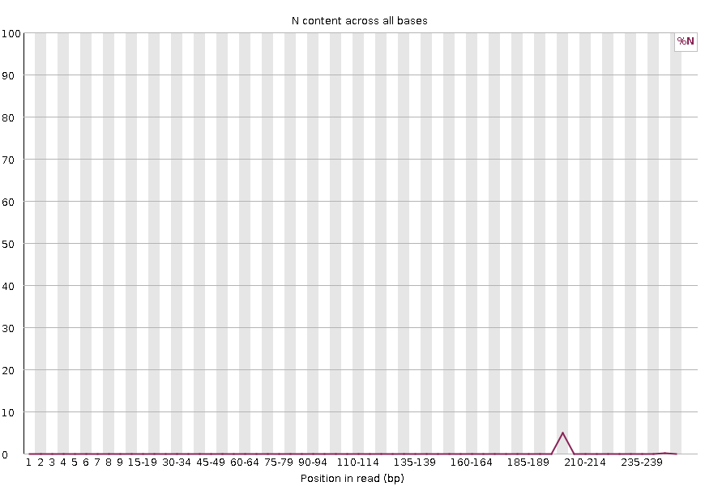

<h1 align="center">
<b>FastQC Report Guide</b>
</h1>

You will be given two collections of data on the right.
We want to look at the "FastQC on collection 1: Webpage" <a href="./fastqc_forward_initial.html" target="blank">forward</a> and <a href="./fastqc_reverse_initial.html" target="blank">reverse</a>.
These reports contain a bunch of useful information, but we generally check a few things first.

## Per base sequence quality

With FastQC we can use the per base sequence quality plot to check the base quality of the reads.
On the x-axis are the base position in the read. In this example, the sample contains reads that are up to 251 bp long.

=== "Forward"
    !!! quote "Figure"
        <figure markdown>
        
        </figure>
=== "Reverse"
    !!! quote "Figure"
        <figure markdown>
        
        </figure>

!!! important
    The x-axis is not always uniform.

    When you have long reads, some binning is applied to keep things compact.
    We can see that in our sample.
    It starts out with individual 1-10 bases.
    After that, bases are binned across a window a certain number of bases wide.
    Data binning means grouping and is a data pre-processing technique used to reduce the effects of minor observation errors.
    The number of base positions binned together depends on the length of the read.
    With reads >50bp, the latter part of the plot will report aggregate statistics for 5bp windows.
    Shorter reads will have smaller windows and longer reads larger windows.
    Binning can be removed when running FastQC by setting the parameter “Disable grouping of bases for reads >50bp” to Yes.

For each position, a boxplot is drawn with:

-   the median value, represented by the central red line
-   the inter-quartile range (25-75%), represented by the yellow box
-   the 10% and 90% values in the upper and lower whiskers
-   the mean quality, represented by the blue line

The y-axis shows the quality scores. The higher the score, the better the base call.
The background of the graph divides the y-axis into very good quality scores, scores of reasonable quality, and reads of poor quality.

It is normal with all Illumina sequencers for the median quality score to start out lower over the first 5-7 bases and to then rise.
The quality of reads on most platforms will drop at the end of the read.
This is often due to signal decay or phasing during the sequencing run.
The recent developments in chemistry applied to sequencing has improved this somewhat, but reads are now longer than ever.

### Signal decay

The fluorescent signal intensity decays with each cycle of the sequencing process.
Due to the degrading fluorophores, a proportion of the strands in the cluster are not being elongated.
The proportion of the signal being emitted continues to decrease with each cycle, yielding to a decrease of quality scores at the 3’ end of the read.

### Phasing

The signal starts to blur with the increase of number of cycles because the cluster looses synchronicity. As the cycles progress, some strands get random failures of nucleotides to incorporate due to:

-   Incomplete removal of the 3’ terminators and fluorophores
-   Incorporation of nucleotides without effective 3’ terminators
-   This leads to a decrease in quality scores at the 3’ end of the read.

### Overclustering

Sequencing facilities can overcluster the flow cells.
It results in small distances between clusters and an overlap in the signals.
Two clusters can be interpreted as a single cluster with mixed fluorescent signals being detected, decreasing signal purity.
It generates lower quality scores across the entire read.

### Instrumentation breakdown

Some issues can occasionally happen with the sequencing instruments during a run. Any sudden drop in quality or a large percentage of low quality reads across the read could indicate a problem at the facility.
Some examples of such issues.

!!! quote "Manifold burst"
    <figure markdown>
    
    </figure>

!!! quote "Cycles loss"
    <figure markdown>
    
    </figure>

!!! quote "Read 2 failure"
    <figure markdown>
    
    </figure>

## Adapter content

The plot shows the cumulative percentage of reads with the different adapter sequences at each position.
Once an adapter sequence is seen in a read it is counted as being present right through to the end of the read so the percentage increases with the read length.
FastQC can detect some adapters by default (e.g. Illumina, Nextera), for others we could provide a contaminants file as an input to the FastQC tool.

Ideally Illumina sequence data should not have any adapter sequence present.
But with long reads, some of the library inserts are shorter than the read length resulting in read-through to the adapter at the 3’ end of the read.

=== "Forward"
    !!! quote "Figure"
        <figure markdown>
        
        </figure>
=== "Reverse"
    !!! quote "Figure"
        <figure markdown>
        
        </figure>

## Per base sequence content

“Per Base Sequence Content” plots the percentage of each of the four nucleotides (T, C, A, G) at each position across all reads in the input sequence file.
As for the per base sequence quality, the x-axis is non-uniform.

!!! quote "Figure"
    <figure markdown>
    
    </figure>

In a random library we would expect that there would be little to no difference between the four bases.
The proportion of each of the four bases should remain relatively constant over the length of the read with `%A=%T` and `%G=%C`, and the lines in this plot should run parallel with each other.

### Biases

It’s worth noting that some library types will always produce biased sequence composition, normally at the start of the read.

=== "RNA-seq"

    Libraries produced by priming using random hexamers (including nearly all RNA-Seq libraries), and those which were fragmented using transposases, will contain an intrinsic bias in the positions at which reads start (the first 10-12 bases). This bias does not involve a specific sequence, but instead provides enrichment of a number of different K-mers at the 5’ end of the reads. Whilst this is a true technical bias, it isn’t something which can be corrected by trimming and in most cases doesn’t seem to adversely affect the downstream analysis. It will, however, produce a warning or error in this module.

    !!! quote "Figure"
        <figure markdown>
        
        </figure>

=== "ChIP-seq"
    ChIP-seq data can also encounter read start sequence biases in this plot if fragmenting with transposases. With bisulphite converted data, e.g. HiC data, a separation of G from C and A from T is expected:

    !!! quote "Figure"
        <figure markdown>
        
        </figure>

## Per sequence GC content

This plot displays the number of reads vs. percentage of bases G and C per read.
It is compared to a theoretical distribution assuming an uniform GC content for all reads, expected for whole genome shotgun sequencing, where the central peak corresponds to the overall GC content of the underlying genome.
Since the GC content of the genome is not known, the modal GC content is calculated from the observed data and used to build a reference distribution.

!!! quote "Figure"
    <figure markdown>
    
    </figure>

An unusually-shaped distribution could indicate a contaminated library or some other kind of biased subset.
A shifted normal distribution indicates some systematic bias, which is independent of base position.
If there is a systematic bias which creates a shifted normal distribution then this won’t be flagged as an error by the module since it doesn’t know what your genome’s GC content should be.

But there are also other situations in which an unusually-shaped distribution may occur.
For example, with RNA sequencing there may be a greater or lesser distribution of mean GC content among transcripts causing the observed plot to be wider or narrower than an ideal normal distribution.

## Sequence Duplication Levels

The graph shows the percentage of reads of a given sequence in the file which are present a given number of times in the file:

!!! quote "Figure"
    <figure markdown>
    
    </figure>

In a diverse library most sequences will occur only once in the final set. A low level of duplication may indicate a very high level of coverage of the target sequence, but a high level of duplication is more likely to indicate some kind of enrichment bias.
Two sources of duplicate reads can be found:

-   PCR duplication in which library fragments have been over-represented due to biased PCR enrichment
    It is a concern because PCR duplicates misrepresent the true proportion of sequences in the input.
-   Truly over-represented sequences such as very abundant transcripts in an RNA-Seq library or in amplicon data (like this sample)
    It is an expected case and not of concern because it does faithfully represent the input.

FastQC counts the degree of duplication for every sequence in a library and creates a plot showing the relative number of sequences with different degrees of duplication.

For whole genome shotgun data it is expected that nearly 100% of your reads will be unique (appearing only 1 time in the sequence data). Most sequences should fall into the far left of the plot. This indicates a highly diverse library that was not over sequenced. If the sequencing depth is extremely high (e.g. > 100x the size of the genome) some inevitable sequence duplication can appear: there are in theory only a finite number of completely unique sequence reads which can be obtained from any given input DNA sample.

More specific enrichments of subsets, or the presence of low complexity contaminants will tend to produce spikes towards the right of the plot. These high duplication peaks will most often appear in the blue trace as they make up a high proportion of the original library, but usually disappear in the red trace as they make up an insignificant proportion of the deduplicated set. If peaks persist in the red trace then this suggests that there are a large number of different highly duplicated sequences which might indicate either a contaminant set or a very severe technical duplication.

It is usually the case for RNA sequencing where there is some very highly abundant transcripts and some lowly abundant. It is expected that duplicate reads will be observed for high abundance transcripts:

## Per base N content

If a sequencer is unable to make a base call with sufficient confidence, it will write an `N` instead of a conventional base call.
This plot displays the percentage of base calls at each position or bin for which an `N` was called.

!!! quote "Figure"
    <figure markdown>
    
    </figure>

It’s not unusual to see a very high proportion of `N`s appearing in a sequence, especially near the end of a sequence
But this curve should never rises noticeably above zero.
If it does this indicates a problem occurred during the sequencing run.

## Additional resources

-   [Galaxy training on quality control](https://gxy.io/GTN:T00239).
